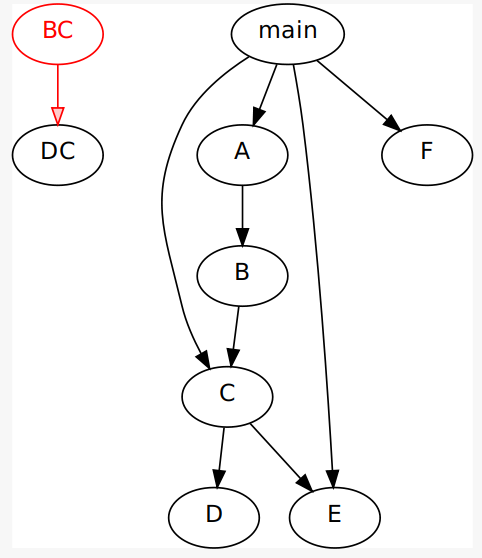

# Static Call Graph Construction using LLVM

### Summary

A call graph is a directed graph that depicts the calling relationships between functions. Each node denotes a function, and each edge (f,g) represents that function f calls function g. There are two common types of call graphs, static and dynamic call graphs. Static call graphs are generated statically, i.e., without running the program. However, a dynamic call graph is produced by running the program with a given input.

This LLVM pass generates a **Static Call Graph** for C and C++ programs. The Call graph generated has the following properties 

- Flow-insensitive
- Field Sensitive (No guarantee as for now)
- Context-insensitive

### **Requirements**

- LLVM + Clang 13  and above
- CMake  3.0 and above

### **System Tested**

- Ubuntu 20 LTS

### **Installing LLVM**

### Installing from Source

You may follow the official link for installation from the source [Getting the source and building LLVM](https://llvm.org/docs/GettingStarted.html#getting-the-source-code-and-building-llvm)

### Pre-compiled Binaries

Download the pre-compiled binaries from the official GitHub repository of LLVM

```bash
wget https://github.com/llvm/llvm-project/releases/download/llvmorg-14.0.0/clang+llvm-14.0.0-x86_64-linux-gnu-ubuntu-18.04.tar.xz
tar -xvf clang+llvm-14.0.0-x86_64-linux-gnu-ubuntu-18.04.tar.xz
```

**Environment variables and PATH**

`sudo vi ~/.bashrc`

```bash
export LLVM_CONFIG=/path/to/llvm/clang+llvm-13.0.0-x86_64-linux-gnu-ubuntu-20.04/bin/llvm-config
export LLVM_DIR=/path/to/llvm/clang+llvm-13.0.0-x86_64-linux-gnu-ubuntu-20.04
export PATH="$PATH:$LLVM_DIR/bin"
```

`source ~/.bashrc`

### 

```bash
clang -v
clang version 13.0.0 (https://github.com/llvm/llvm-project/ 24c8eaec9467b2aaf70b0db33a4e4dd415139a50)
Target: x86_64-unknown-linux-gnu
Thread model: posix
InstalledDir: /home/bernard/LLVM/clang+llvm-13.0.0-x86_64-linux-gnu-ubuntu-20.04/bin
Found candidate GCC installation: /usr/lib/gcc/x86_64-linux-gnu/9
Selected GCC installation: /usr/lib/gcc/x86_64-linux-gnu/9
Candidate multilib: .;@m64
Candidate multilib: 32;@m32
Candidate multilib: x32;@mx32
Selected multilib: .;@m64
```

IIf the output is similar to the above, you’re successfully installed LLVM and Clang.

### Installing Cmake

```bash
sudo apt-get -y install cmake
cmake --version
cmake version 3.23.0
```

### Download the Callgraph LLVM Pass

```bash
git clone https://github.com/bernardnongpoh/CallGraph.git
```

### Building the CallGraph LLVM Pass

```bash
cd Callgraph
CallGraph$ mkdir build
Callgraph$ cd build
$CallGraph/build$ cmake ..
Consolidate compiler generated dependencies of target CallGraph
[100%] Built target CallGraph
```

### Running and Testing the Call Graph LLVM Pass

Go back to the root directory of **CallGraph** `cd ..`

```bash
./run.sh test/test_case.c
Graphical Graph: xdot graph.dot
Text Format: gedit graph.txt
```

The [graph.dot](http://graph.dot) is the call graph corresponding to the program **test_case.c**

```c
void DC(){}
void BC(){
DC();
}

void C();
void F( ) { }
void E( ) { }
void D( ) { }
void C( ) { D( ) ; E( ) ; }
void B( ) { C( ) ; }
void A( ) { B( ) ; }
int main ( ) {
void (* p) ( ) ;
A( );
p = &C;
(*p)( ) ;
struct s{
void (* q) ( ) ;
int value;
} s1;
s1.q = &F;
s1.q();

void (*q)();
int a=10;
if(a>10){
    q=&F;
}
else{
    q=&E;

}
(*q)();
}
```

### Static Call Graph



References

- [https://llvm.org/docs/GettingStarted.html#getting-the-source-code-and-building-llvm](https://llvm.org/docs/GettingStarted.html#getting-the-source-code-and-building-llvm)
- [https://www.cs.purdue.edu/homes/xyzhang/spring17/cs510-llvm-S17.pdf](https://www.cs.purdue.edu/homes/xyzhang/spring17/cs510-llvm-S17.pdf)